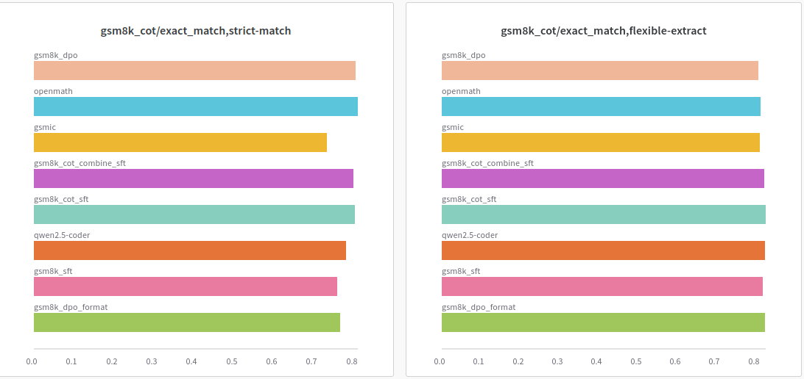
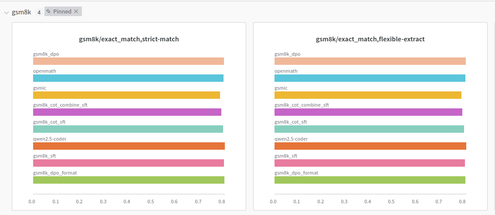
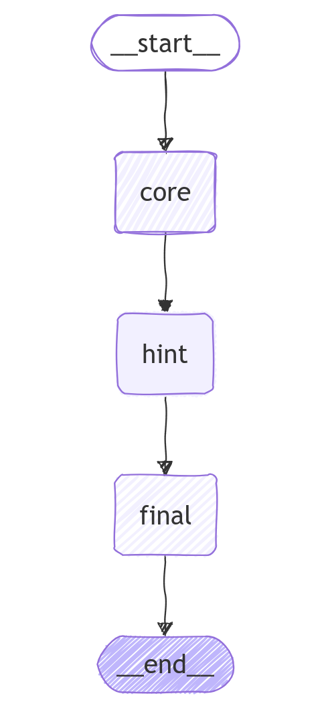

## Experiments on Qwen2.5-Coder-7B
### Todo
* [x] Models merging with Slerp-Merge and Ties-Merge using [Mergekit](https://github.com/arcee-ai/mergekit)
* [x] SFT using GSM8k, GSMIC, OpenmathInstruct2 (200K sample), GSM8k COT
* [x] DPO using GSM8K preference [dataset](https://huggingface.co/datasets/nbalepur/gsm8k_preferences) and self generated HarnessEval format dpo set.
* [ ] [DUP](https://arxiv.org/abs/2404.14963) based langgraph agents (not yet evaluated) 
* [ ] TIR evaluation as Qwen2.5-Coder is a code generated model
All experiment was done with a A40 rented on Runpod
### Checkpoint path

- [All Loras](https://huggingface.co/khoantap/Qwen2.5-Coder-7B-GSM8k-LORA/tree/main)
- [Openmath Lora](https://huggingface.co/khoantap/Qwen2.5-Coder-7B-OpenMath-200K-Lora)

### Key Result





### Script
```
bash interview/eval.sh
bash interview/merge.sh
```

### Langgraph DUP Agent



```python
llm = VLLM(
    model="Qwen/Qwen2.5-7B-Instruct",
    trust_remote_code=True,
    top_p=0.95,
    temperature=0.1,
)
graph = QwenDupAgent(llm).get_agent_graph()
graph.invoke( {"question" : "Natalia sold clips to 48 of her friends in April, and then she sold half as many clips in May. How many clips did Natalia sell altogether in April and May?"})
```
